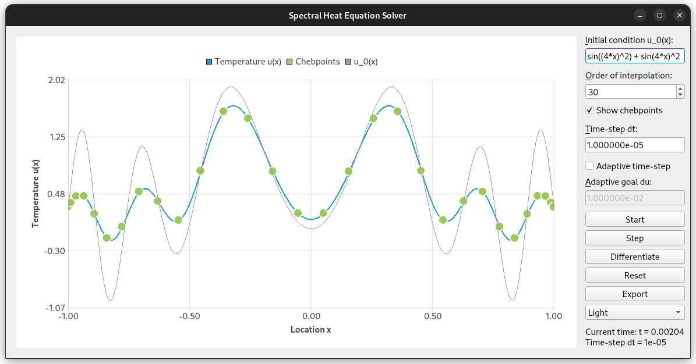

# HeatFun - a spectral solver

Exploring the heat equation as part of a Special Topic for Approximation of Functions.

**Solving PDEs using Spectral Methods in the Chebyshev basis by example of the Heat Equation.**
A Special Topic on Approximation of Functions.

_Screenshot of the graphical user interface. After entering an initial expression
u0(x), depicted in grey, the simulation will run upon pressing ’Start’. The solution at
time t, depicted in blue, is represented as a Chebyshev series of degree 29._

Partial differential equations are notoriously hard to solve. One more possible approach
to make way in this important class of problems is by the technique of spectral methods,
incidentally closely related to finite element methods. The key idea is to perform the
problem solution by representation of the occurring functions in a certain basis. For
non-periodic problem settings, Chebyshev series are a fantastic choice.

This work shall attempt to numerically solve the heat equation ut = αuxx
with Dirichlet boundary conditions over the domain [−1, 1] × [0, T] by representing the spatial component as a Chebfun (Chebyshev series) and moving on
in time by the Forward Euler numerical scheme.

The implementation, centered around what we will refer to as TschebFun, including three major algorithms TschebFun::interpolantThrough(),
TschebFun::evaluateOn() and TschebFun::derivative(), is done manually
in C++, extended to work as a Python module and for demonstration, even
features a high-level graphical interface to play with. Finally, we will compare
the numerical results with the output of Chebfun’s high-level pde15s().
